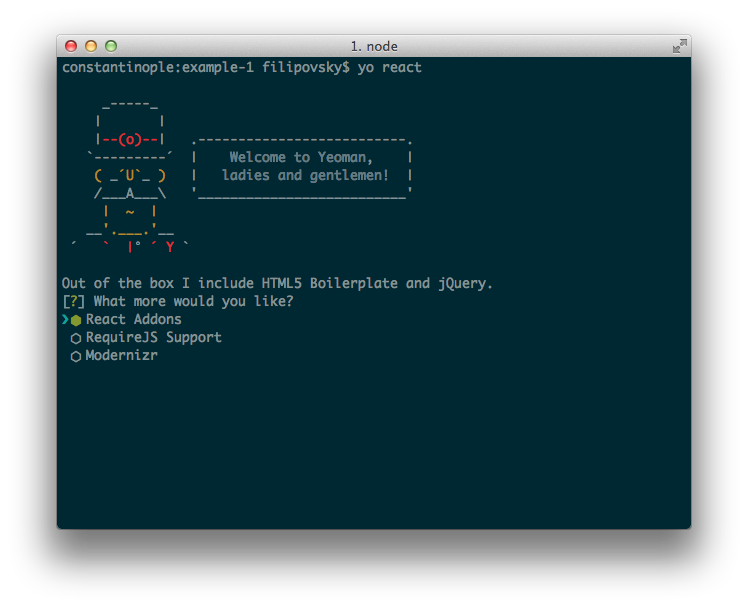
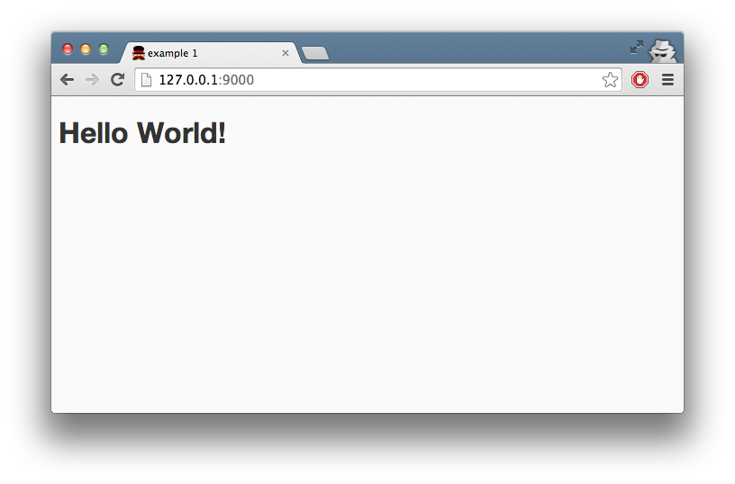

# React.js для самых маленьких

## План

1. История, мотивация
2. Основные концепции:

    * Reactive programming
    * View from MVC (Components)
    * Virtual DOM

3. Начало работы/setup
4. Описания компонентов, render() метод, state/props
5. JSX
6. Events, Data bindings
7. Заключение

## Статья

<!-- 1 -->

[React.js][reactjs] -- фреймворк для создания интерфейсов от Facebook. В
последнее время онлайн и на [MoscowJS][moscowjs] было много разговоров о
нём. Как всегда с опозданием, я смог опробовать React только на днях.

В этой статье я в двух словах расскажу о концепциях, которые стоят за
фреймворком и покажу как быстро начать с ним работать.

## Основные концепции

### View из [MVC][wiki-mvc]

React позволяет создавать интерфейсы. В известном паттерне
Model-View-Controller React ближе всего к пользователю. Он отвечает за
представление данных, получение и обработку ввода пользователя. Где и в
каком виде вы храните данные, как вы общаетесь с хранилищем, дело ваше.
React -- это всего лишь View вашего приложения.

### Реактивное программирование

React построен на парадигме [реактивного
программирования][reactive-programming]. Этот декларативный подход
предлагает описывать данные в виде набора утверждений или формул.
Изменение одного из параметров ведёт за собой автоматический пересчёт всех
зависимостей.

##### Пример из [Википедии][wiki-reactive]

В [императивном][wiki-imperative] программировании выражение

    a = b + c

Означает взять текущие значения `'b'` и `'c'`, сложить их и присвоить `'a'`
результат. Дальнейшие изменения параметров `'b'` и `'с'` не влияют на `'a'`.

В [реактивном][wiki-reactive-ru] программировании то же выражение:

    a = b + c

Означает, что `'a'` есть сумма `'b'` и `'с'`. Если `'b'` или `'c'`
изменятся в будущем, это отразится на величине `'a'`.

##### Excel -- как реактивная среда разработки

Помните формулы в таблицах Excel? Те, в которых значения в ячейках зависят
друг от друга? Это реактивное программирование в действии. При изменении
значения в одной ячейке, зависимые ячейки пересчитываются автоматически.

###  Виртуальный DOM

Работа с [DOM][w3c-dom] в браузере часто оказывается источником проблем с
производительностью. Создатели React решили проблему радикально. Ребята
написали реализацию DOM на JavaScript. Фреймворк использует её, чтобы при
изменении состояния компонент судить о том, что поменять в реальном DOM и
как сделать это эффективно.

## Начало работы

Чтобы начать работать с React, просто подключите его на страницу:

    

Хотя, если вы стартуете проект с нуля, я рекомендую использовать готовый
генератор для [yeoman][yeoman]: [generator-react][generator-react]. Для
этого:

1. Устанoвите [node.js][node], если вы ещё не сделали этого;
2. Откройте терминал и установите [yeoman][yeoman], [grunt][grunt],
   [bower][bower] и сам генератор с помощью [npm][npm]:

        npm install -g yeoman grunt-cli bower generator-react

3. Создайте папку с проектом и перейди в неё;
4. Запустите генератор:

        yo react

5. Оставьте галочку в пункте `React with Addons` и остальные по желанию;

    

6. Установите клиентские зависимости с помощью bower:

        bower install

7. Запустите проект:

        grunt serve

    

## Hello World

Компонент в React описывает интерфейс приложения. А именно то, как должна
выглядеть та или иная часть страницы на основе **состояния компонента**.

Помните пример с Excel? В любой момент времени в ячейке с формулой
находится значение, полученное на основе ячеек с данными. Измените
значение в ячейке с данными, результат поменяется в ячейке с формулой.

React следует тому же принципу. Компонент описывает, как получить разметку
на основе состояния. Как ячейка с формулой. При изменении состояния --
меняется разметка.

При создании проекта с помощью `yo react`, пример компонента уже лежит в
папке `app/jsx/app.jsx`. JSX это надстройка над JS, которую рекомендует
использовать React для описания компонентов. Я расскажу о JSX подробнее
позже. Пока посмотрим как выглядит **JS** код компонента, который получен
после компиляции `app.jsx`:

##### app/scripts/app.js

    var HelloWorld = React.createClass({
      displayName: 'HelloWorld',

      getInitialState: function() {
        return {message: 'Hello World!'};
      },

      goodbye: function(event) {
        this.setState({message: 'Goodbye World.'});
      },

      render: function() {
        return (
          React.DOM.h1({onClick:this.goodbye}, this.state.message)
        );
      }
    });

    React.renderComponent(
      HelloWorld(null),
      document.getElementById('app')
    );

В двух словах расскажу об этом коде, и потом рассмотрим каждую часть
подробно.

`React.createClass()` создаёт класс React компонента `HelloWorld`.
Компонент затем добавляется в документ с помощью
`React.renderComponent()`.

При создании класса компонента `HelloWorld`, мы задаём ему некоторые
свойства и методы:

  * `displayName` -- имя компонента;

  * `getInitialState()` -- метод возвращает начальное состояние
    компонента;

  * `render()` -- метод возвращает Virtual DOM дерево на основе
    состояния компонента;

  * `goodbye()` -- функция, которую вызвовёт пользователь кликом на
    компонент. Её задача -- изменить состояние компонента.

#####  React.createClass()

`React.createClass({})` -- создаёт класс React-компонента.

##### Метод render()

Фреймворк вызывает `render()` при добавления компонента на страницу и каждый
раз, когда его состояние или состояние **его родителей** меняется.

    React.createClass({
      // ...

      render: function() {
        // Возвращает Virtual DOM разметку
        return (
          React.DOM.h1({onClick:this.goodbye}, this.state.message)
        );
      }
    });

`render()` возвращает разметку в виде Virtual DOM дерева. Чтобы
сформировать такое дерево, в React предусмотрен набор функций в
пространстве имён React.DOM. Мы также можем использовать React классы,
которые написали сами.

Каждая функция в пространстве имён React.DOM называется по имени
элемента, который она создаёт (`React.DOM.h1`, `React.DOM.input` и
т.д.).

React.DOM функции и классы наших компонентов принимают в качестве
первого аргумента объект со свойствами (`props`).

Например, такая разметка:

    <input type="text" placeholder="Email" />

Представленная в виде Virtual DOM дерева выглядит так:

    React.DOM.input({type: 'text', placeholder: 'Email'});

В `props` также указываем обработчики интересующих нас событий:

    React.DOM.h1({onClick:this.goodbye}, ...);

Подробнее о том, какие события доступны в Virtual DOM, [смотрите
здесь][react-events].

Второй и последующие аргументы React.DOM функций добавляются в содержимое
созданного компонента. В качестве содержимого годится текст и React-компоненты.

Такая разметка:

    <ul>
       <li>Text</li>
       <li>
         <a href="www.url.com">Link</a>
       </li>
    </ul>

В React.DOM выглядит так:

    React.DOM.ul(null,
        React.DOM.li(null, "Text"),
        React.DOM.li(null,
            React.DOM.a({href:"www.url.com"}, "Link")
        )
    )

##### Изменяемое состояние компонента, атрибут `state`

**Изменяемое** состояние компонентов в React хранится в атрибуте `state`.
При создании компонента, фреймворк вызывает метод `getInitialState()`,
который мы переопределяем. Метод возвращает объект с начальным состоянием.

    var HelloWorld = React.createClass({
      ...

      getInitialState: function() {
        return {message: 'Hello World!'};
      },

      ...
    });

Доступ к состоянию компонента осуществляется с помощью атрибута `state`:

    render: function() {
      ...
      return React.DOM.h1({...}, this.state.message);
    }

Чтобы изменить состояние, необходимо вызвать `setState()`, передав туда
объект с атрибутами, которые мы хотим изменить. Например:

    /* this -- наш React компонент */
    console.log(this.state);      // {a: 1, b: 1}
    this.setState({b: 2, c: 2});
    console.log(this.state);      // {a:1, b: 2, c: 2}

Метод `replaceState()` заменяет текущее состояние на новое. В отличие от
`setState()`, слияния не происходит. Например:

    /* this -- наш React компонент */
    console.log(this.state);      // {a: 1, b: 1}
    this.replaceState({b: 2, c: 2});
    console.log(this.state);      // {b: 2, c: 2}

Методы `setState()` и `replaceState()` приведут к вызову метода `render()`
и повторной отрисовке компонента.

##### Неизменяемое состояние компонента, `props`

Неизменяемое состояние компонента передаётся ему в качестве аргумента при
создании. Если бы мы хотели изменить `HelloWord` так, чтобы он принимал в
качестве аргумента начальное сообщение, мы бы сделали так:

    var HelloWorld = React.createClass({
      ...

      getInitialState(): function() {
        return {message: this.props.welcomeMessage};
      }
      ...
    });

    React.renderComponent(
      HelloWorld({welcomeMessage: 'Hello World!'}),
      document.getElementById('app')
    );

При создании компонента `HelloWorld`, в качестве первого аргумента мы
передаём объект с `props`. В данном случае
`{welcomeMessage: 'Hello World!'}`. Эти свойства доступны в контексте
компонента через `this.props`.

##### Когда использовать `state` и `props`

При создании структуры компонентов, старайтесь не "размазывать" изменяемое
состояние (`state`) по компонентам. Изолируйте его в отдельные классы.

В React данные передаются сверху-вниз. Компонент, в методе `render()`
которого создаются другие компоненты, передаёт им данные через `props`.
Когда состояние "создателя" меняется, изменения автоматически отражаются
в состоянии детей.

#####  React.renderComponent()

Эта функция добавляет React-компонент на страницу. В качестве первого
аргумента принимает React-компонент, в качестве второго -- DOM-элемент.

    React.renderComponent(
      HelloWorld(null),
      document.getElementById('app')
    );

## JSX

[JSX][jsx] -- ещё один проект от Facebook. Это надстройка на JavaScript,
которая позволяет использовать про-XML синтаксис в JS коде. JSX
рекомендуют использовать при написании React компонентов по нескольким
причинам:

* С помощью него проще представить итоговый DOM;
* Дизайнерам привычнее работать с таким кодом;
* В нём просто разобраться, если вы знакомы с MXML или XAML.

##### app/jsx/app.jsx

Так выглядит метод `render()` `HelloWorld` компонента, написанный с
использованием JSX:

    var HelloWorld = React.createClass({
      ...
      render: function() {
        return (
          <h1 onClick={this.goodbye}>{this.state.message}</h1>
        );
      }
      ...
    });

Во что этот код компилируется, мы уже знаем:

    var HelloWorld = React.createClass({
      ...
      render: function() {
        return (
          React.DOM.h1({onClick:this.goodbye}, this.state.message)
        );
      }
      ...
    });

Конечно, писать на JSX удобнее. Но стоит иметь ввиду, что вам нужно
встраивать компиляцию JSX в JavaScript в процесс сборки проекта.
Это вызовет трудности, особенно если вы уже используете препроцессоры,
вроде компилятора CoffeeScript или Browserify.

## Заключение

Признаюсь, поначалу React кажется до смешного абсурдным фреймворком. Его
создатели пришли к выводу, что работать с DOM медленно, и написали свою
реализацию DOM на JavaScript. А затем запилили свой язык, чтобы перенести
разметку в JS-код… Все эти решения до сих пор кажутся мне сомнительными.

Но не смотря на это, мне было приятно писать на React. Идея применить
реактивный подход при написании интерфейсов определённо работает.
Разбивать интерфейс на переиспользуемые компоненты идея не новая, но в
React это реализовано естественно и просто.

Отдельно хочу отметить, насколько легко тестировать React-компоненты.
Задаём состояние с помощью `props` и `setState()`, вызываем `render()` и
проверяем, что результат соответствует ожиданиям.

На последок, два небольших приложения для демонстрации.

### Commenter

Система комментирования, похожая на ту, что [работает в
Medium][medium-comments]. Написана с использованием генератора
`generator-react`:

Демо: [http://filipovskii.github.io/react-commenter/#/](http://filipovskii.github.io/react-commenter/#/)

Код: [https://github.com/filipovskii/react-commenter](https://github.com/filipovskii/react-commenter)

### Word Cloud

Что-то вроде облака тегов. Каждый тег обладает размером и цветом, который
определяется на основании данных о нём.

В этом приложении используются `React`, `Gulp` и `Browserify`. Обратите
внимание на то, как просто [написаны тесты][word-cloud-tests].

Демо: [http://filipovskii.github.io/word-cloud-challenge/](https://github.com/filipovskii/word-cloud-challenge)

Код: [https://github.com/filipovskii/word-cloud-challenge](https://github.com/filipovskii/word-cloud-challenge)

## А что вы думаете?

Вы уже во всю используете React? Или только присматриваетесь к нему? Дайте
знать, что вы думаете, в комментариях, или [напишите письмом][mail].

[moscowjs]: http://moscowjs.ru
[reactjs]: http://facebook.github.io/react/
[reactive-programming]: http://en.wikipedia.org/wiki/Reactive_programming
[wiki-reactive]: http://en.wikipedia.org/wiki/Reactive_programming
[wiki-imperative]: http://ru.wikipedia.org/wiki/%D0%98%D0%BC%D0%BF%D0%B5%D1%80%D0%B0%D1%82%D0%B8%D0%B2%D0%BD%D0%BE%D0%B5_%D0%BF%D1%80%D0%BE%D0%B3%D1%80%D0%B0%D0%BC%D0%BC%D0%B8%D1%80%D0%BE%D0%B2%D0%B0%D0%BD%D0%B8%D0%B5
[wiki-reactive-ru]: http://ru.wikipedia.org/wiki/%D0%A0%D0%B5%D0%B0%D0%BA%D1%82%D0%B8%D0%B2%D0%BD%D0%BE%D0%B5_%D0%BF%D1%80%D0%BE%D0%B3%D1%80%D0%B0%D0%BC%D0%BC%D0%B8%D1%80%D0%BE%D0%B2%D0%B0%D0%BD%D0%B8%D0%B5
[wiki-mvc]: http://en.wikipedia.org/wiki/Model%E2%80%93view%E2%80%93controller
[wiki-dom]: http://en.wikipedia.org/wiki/Document_Object_Model
[w3c-dom]: http://www.w3.org/DOM/
[yeoman]: http://yeoman.io/
[generator-react]: https://www.npmjs.org/package/generator-react
[node]: nodejs.org
[grunt]: http://gruntjs.com/
[bower]: http://bower.io/
[npm]: https://www.npmjs.org/
[react-events]: http://facebook.github.io/react/docs/events.html
[jsx]: http://facebook.github.io/react/docs/jsx-in-depth.html
[word-cloud-tests]: https://github.com/filipovskii/word-cloud-challenge/tree/master/test/spec
[medium-comments]: https://medium.com/about/why-medium-notes-are-different-and-how-to-use-them-well-5972c72b18f2
[mail]: mailto:hello@andreysalomatin.me
