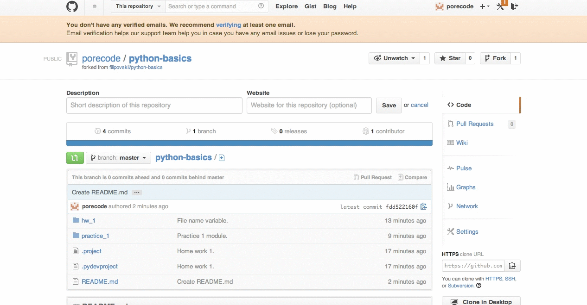

# Среда Разработки: Практика

##  Интерпретатор

Загрузите и установите Python:
[http://python.org/download/releases/2.7.6][interpreter].

Запустите командную строку: `Start ‣ Programs ‣ Accessories ‣ Command
Prompt`

Чтобы запустить интерпретатор, наберите в командой строке:

    C:\Python27\python

    Python 2.7.6 (default, Nov 10 2013, 19:24:24)
    [MSC v.1500 64 bit (AMD64)] on win32
    Type "help", "copyright", "credits" or "license" for more information.
    >>>

## Арифметика в интерпретаторе

Арифметические операции в python выглядят так, как мы привыкли. Однако
результат операций над целыми числами всегда целое число. Чтобы получить
число с плавающей точкой, хотя бы один операнд должен быть числом с
плавающей точкой.

Операция `**` &mdash; это возведение в степень.

Запустите в интерпретаторе:

    1 + 1
    1 / 2
    1.0 / 2
    2 ** 3
    (2 ** 3) / ( 3 ** 2 )
    (2 ** 3) / float(3 ** 2)

## Функция help()

Чтобы получить справку о функции, вызовите `help([имя функции])`.
Например:

    >>> help(min)
    Help on built-in function min)in module __builtin__:
    ...
    >>> help(float)
    Help on class float in module __builtin__:
    ...

## Интерпретация файла

Один из способов запустить программу на python, запустить интерпретатор из
командной строки и передать путь к файлу с python кодом в качестве
аргумента.

  1. Создайте файл `hello.py` с содержимым

        name = raw_input("What's your name? > ")
        print("Hello, {}!".format(name))

  2. Запустите командную строку: `Start ‣ Programs ‣ Accessories ‣ Command
  Prompt`

  3. Запустите интерпретатор:

        C:\Python27\python [путь к hello.py]\hello.py

##  PyDev

Установите PyDev, плагин для Eclipse, который позволяет разрабатывать на
Python.

  1. [Загрузите JDK][java]
  2. [Загрузите Eclipse][eclipse]
  3. В Eclipse: `Help ‣ Eclipse Marketplace`
  4. Найдите и установите плагин PyDev

## PyDev проект

  1. В Eclipse: `File ‣ New ‣ Other`
  2. В появившемся окне выберите: `PyDev ‣ PyDev Project`
  3. Создайте проект с названием `HelloProject`
  4. Создайте новый файл с именем `hello.py` в проекте
  5. Скопируйте в `hello.py` следующее содержимое:

        name = raw_input("What's your name? > ")
        print("Hello, {}!".format(name))

  6. Запустите:

      ![Eclipse Launch][eclipse-launch]

## Совместная работа в GitHub

  1. Загрузите и установите [git](http://git-scm.com/download/win)
  2. Создайте аккаунт на [github][github]
  3. Найдите [репозитрий тренинга][repo] и создайте форк.

     

     Теперь на GitHub есть ваша версия репозитория.

  4. Найдите среди **своих** репозиториев `python-basics`, скопируйте
     https-ссылку на него:

     

  5. Импортируйте проект в Eclipse:

     

  6. В модуле `practice_1` создайте файл с вашим именем, например
     `aleksey.py`. В нём напишите программу, которая печатает ваше имя.

  7. Сделайте commit:

     

  8. Сделайте push:

     

  9. Создайте pull-request из вашего форка на github в оригинальный
     репозиторий:

     

[eclipse]: //www.eclipse.org/downloads/
[java]: //www.oracle.com/technetwork/java/javase/downloads/index.html
[interpreter]: http://python.org/download/releases/2.7.6/
[win-git]: http://windows.github.com/
[github]: https://github.com
[repo]: https://github.com/filipovskii/python-basics

[eclipse-launch]: eclipse-launch.png
[fork]: fork.png
