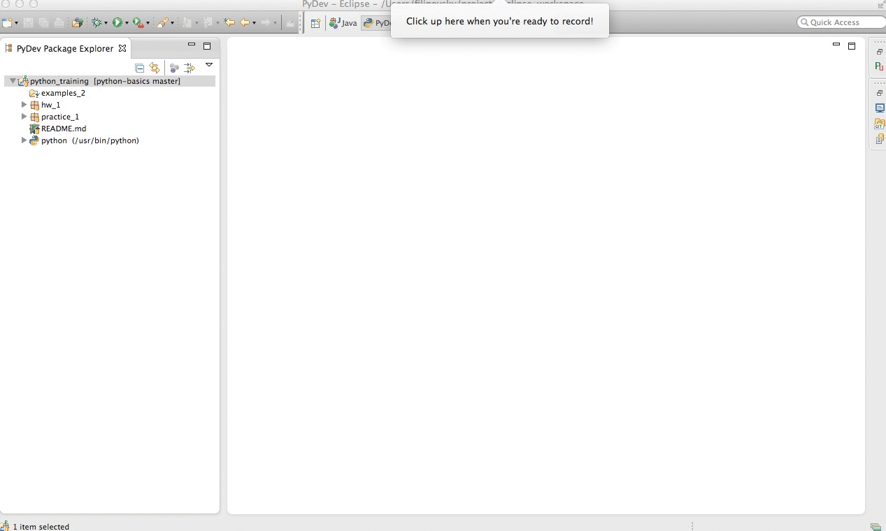

# Git &mdash; Практика

## Fetch удалённого репозитория

1. Добавьте `remote` ссылку с именем `original-repo`. `Remote` должен
   указывать на [оригинальный репозиторий][original-repo]:

     

2. Влейте изменения из `master` бранча репозитория `original-repo` в
   локальный `master` бранч:

     

## История коммитов файла

Определите пользователей, который изменяли файл `hw_1/hash_my_name` с
помощью `Team -> Show Annotations`. Перечислите имена этих пользователей,
когда будете создавать следующий pull-request в оригинальный репозиторий.

## Checkout коммита

Определите список файлов, который содержала директория `hw_1` на момент
коммита `50a5569 (File name variable)`. Используйте `checkout`.
Перечислите имена файлов, когда будете создавать следующий pull-request в
оригинальный репозиторий.

## Tag

1. Создайте `tag`, который будет ссылаться на последний коммит в `master`
   бранче. Имя тега: `[ваше имя]-0.1`, наприме `andrey-0.1`;

     

2. Сделайте `push` созданного тега в ваш репозиторий на GitHub:

     

## Reset

1. Создайте бранч `practice/back-in-time`, основанный на локальном
   `master` бранче;

2. Сделайте `reset` бранча на коммит `877096c (Practice 1 module)`

3. Настройте локальный репозиторий таким образом, чтобы изменения в бранче
   `practice/back-in-time` попадали в ваш удалённый репозиторий на GitHub.

4. Сделайте `push`.

В вашем GitHub репозитории должен появиться бранч `practice/back-in-time`.
Последним коммитом в нём должен быть `877096c (Practice 1 module)`.

# Python syntax &mdash; Практика

Выполняйте каждую задачу в отдельном бранче. Затем сливайте изменения в
`master`. Имя бранча должно быть вида `practice\[task-name]`.

Чтобы сохранить историю ветвлений, при `merge` необходимо
выбрать: `if a fast-forward, create a merge commit`.

После выполнения всех заданий, синхронизируйте все бранчи локального
репозитория с вашим удалённым репозиторием на GitHub и создайте
pull-request.

## assertions

В папке `practice_2` создайте файл `[first_name]_assertions.py` (например
`andrey_assertions.py`).

Работайте в парах.

В этом файле реализуйте следующие функции:

    assert_equal(a, b)
    assert_not_equal(a, b)
    assert_true(x)
    assert_false(x)
    assert_is(a, b)
    assert_is_not(a, b)
    assert_is_none(x)
    assert_is_not_none(x)
    assert_in(a, b)
    assert_not_in(a, b)

Каждая из них проверяет соответствующее утверждение и кидает исключение,
если утверждение не верно.

На каждую функции должно быть два или более теста.

## dividers

В файле `practice_2/[first-name]_iter` реализуйте функцию `dividers(x)`,
которая возвращает список всех делителей числа `x`. Операция деление по
модулю в python: `a % b`. Например:

    >>> dividers(10)
    [1, 2, 5]

## booleans

Объекты в python можно привести к bool-типу с помощью функции `bool()`. В
файле `practice_2/[first-name]_iter` реализуйте функцию `to_bool(lst)`,
которая преобразует каждый элемент списка `lst` в bool-тип и возвращает
получившийся список. Например:

    >>> to_bool([0, 1, '', 'a'])
    [False, True, False, True]

[original-repo]: https://github.com/filipovskii/python-basics
